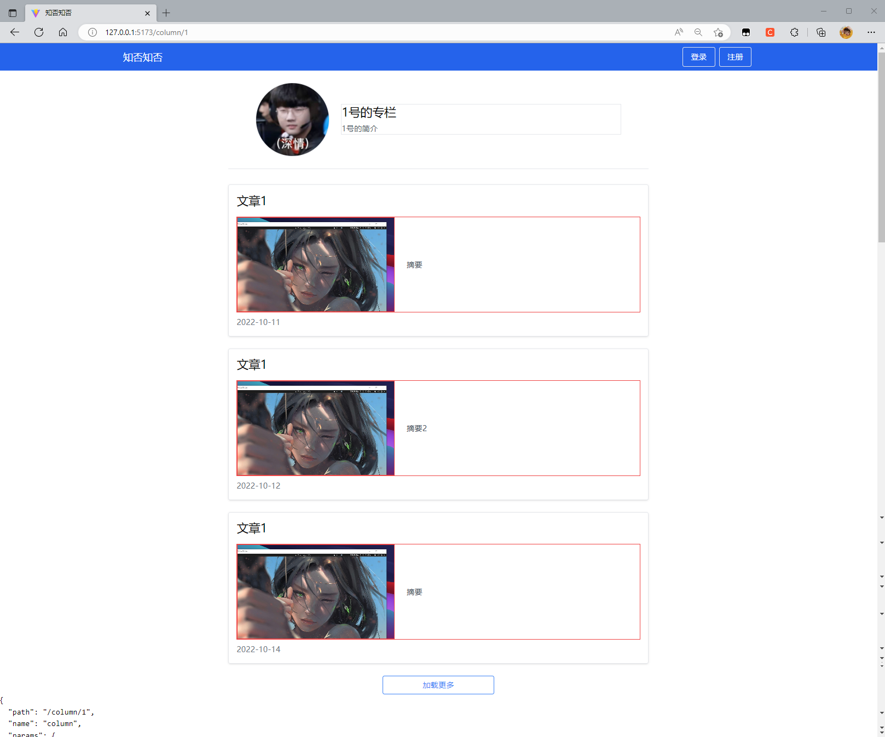

## 知否知否

---
主页


---
专栏信息



---
登录界面


---
编辑资料


---


## Vue 3 + TypeScript + Vite

This template should help get you started developing with Vue 3 and TypeScript in Vite. The template uses Vue 3 `<script setup>` SFCs, check out the [script setup docs](https://v3.vuejs.org/api/sfc-script-setup.html#sfc-script-setup) to learn more.

## Recommended IDE Setup

- [VS Code](https://code.visualstudio.com/) + [Volar](https://marketplace.visualstudio.com/items?itemName=Vue.volar)

## Type Support For `.vue` Imports in TS

Since TypeScript cannot handle type information for `.vue` imports, they are shimmed to be a generic Vue component type by default. In most cases this is fine if you don't really care about component prop types outside of templates. However, if you wish to get actual prop types in `.vue` imports (for example to get props validation when using manual `h(...)` calls), you can enable Volar's Take Over mode by following these steps:

1. Run `Extensions: Show Built-in Extensions` from VS Code's command palette, look for `TypeScript and JavaScript Language Features`, then right click and select `Disable (Workspace)`. By default, Take Over mode will enable itself if the default TypeScript extension is disabled.
2. Reload the VS Code window by running `Developer: Reload Window` from the command palette.

You can learn more about Take Over mode [here](https://github.com/johnsoncodehk/volar/discussions/471).


====

1. mitt, 在validateForm中使用报错， emitter.emit not a function, 将emitter定义在mittBus中然后导出。
2. API: http://duanhf.cn:8099/public/swagger/index.html#/user/post_api_user_login
3. inheritAttrs 禁止attrs穿透，写在子组件的位置。
4. 使用mock 数据 安装：`npm i --save-dev @types/mockjs` 
5. 卸载： `mock npm uninstall --save-dev @types/mockjs` 
6. json-server `json-server db.json --routes routes.json`


1. 安装Babel支持的Vue的jsx插件 `npm install @vue/babel-plugin-jsx -D`
2. Vite环境 `npm install @vitejs/plugin-vue-jsx -D`


---
未解决：
1. createMessage，render，h函数
2. 将login currentUser的JSON 放在json server中


```ts
  <message>
    <message-item />
    <message-item />
    <message-item />
    <message-item />
  </message>
```

---
已完成：
1. login.vue ok


----

npm i less


---

出现的问题
return 回去的数据格式
成功和失败都返回这个格式，通过code来判断，但是then  和 catch判断条件
{
  code:
  data: {}
  time: {}
  msg: {}
}
--

column 专栏没有默认图片，在columnlist中新加一个 computed属性，对props传过来的图片进行验证
如果没有图片，则添加默认图片 ||      使用自定义指令


获取指定id的专栏
http://localhost:8081/api/column/detail?id=1
获取指定id专栏的post


下一步，修改数据库，调试端口。
显示专栏文章。
修改专栏，
编辑资料
注册。


login.vue 和 signup.vue 按钮位置
login.vue 和 signup 输入信息之后 清空输入框

---
edit 暂停
createPost
deletePost
updatePost

测试上传图片。

点击选中图片上传，此时img 是转圈的状态，且不可操作，操作完成之后，显示上传后的图片

修改form 尺寸

图片上传，设置默认图片


md编辑器

---

TODO:
0. store getPostsByCid == 和 ===的问题
1. CreatePost 的图片样式，和 ColumnDetail post的图片样式一样。 和 post
2. 提交普通表单，textarea，后期再改用markdown
3. uploader 上传组件修改。
4. createPost 和 editPost 合在一块。
